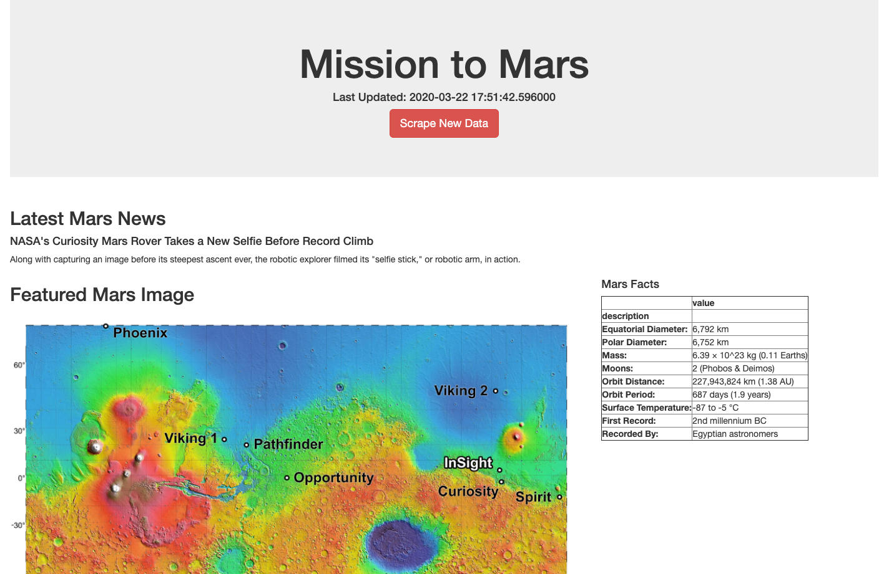

# Mission-to-Mars

# Module 10 Challenge.
# Mission to Mars Dynamic Website
Robin’s really happy with how her web app—and her portfolio—turned out. After some thought, she has decided her web app needs a bit more…oomph. She would like to add high resolution images for each of Mars’ hemispheres (Links to an external site.). The quality of the images will bring an extra level of aesthetic appeal to her app.

## Resources
- Input: https://mars.nasa.gov/news/
- Input: https://www.jpl.nasa.gov/spaceimages/?search=&category=Mars
- Input: http://space-facts.com/mars/
- Input: https://astrogeology.usgs.gov/search/results?q=hemisphere+enhanced&k1=target&v1=Mars
- Software: FLASK, Splinter, ChromeDriver, BeautifulSoup, MongoDB, Bootstrap,  Python 3.6.1., Jupyter Notebook

## BootStrap Updates
1) Added template for Scraping results
2) Added button for Scraping html to return to the home page
3) Added auto redirect to the main page after scraping
4) updated index.html to add some spacing along the left side for a cleaner look
5) Changed sytle of scraping button

## Portfolio
Screenshot from the web App

PDF printout of the full webpage
[PDF Document](Mission%20to%20Mars.pdf)
